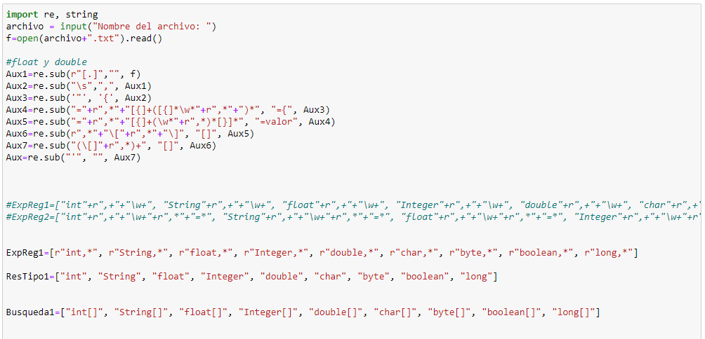
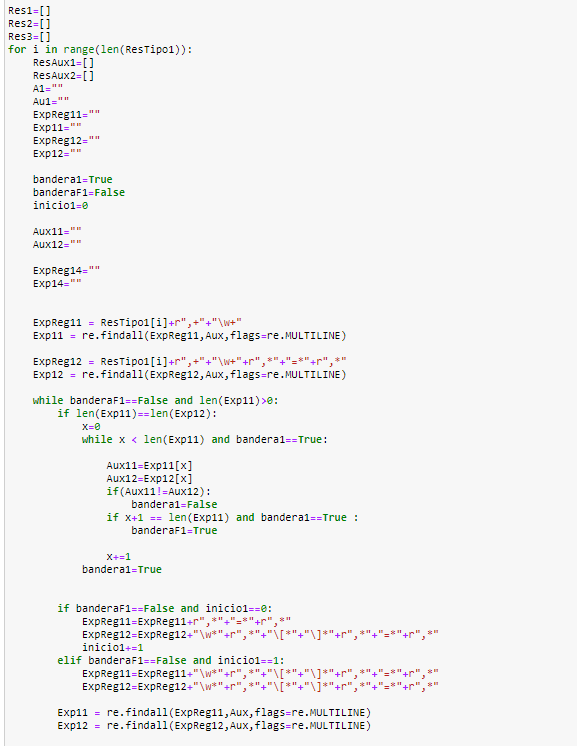
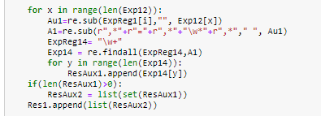
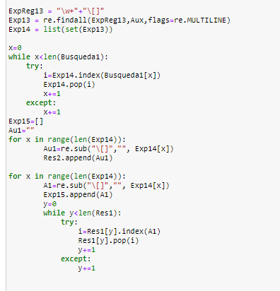
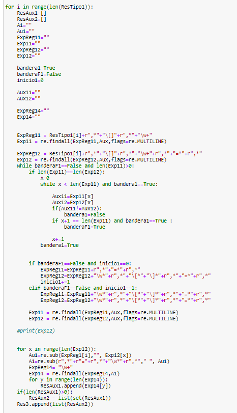
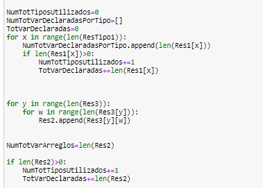
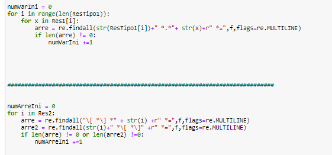
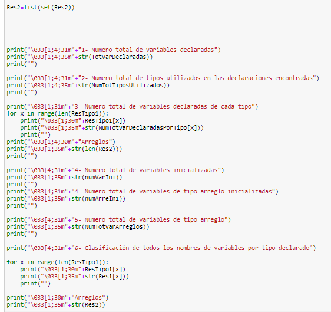
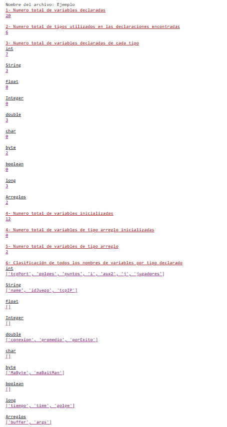

# Proyecto 1: Reconocimiento de declaraciones

## Integrantes: 

* José David Barranco 
* Francisco González
* Bernardo Paniagua
* Larissa Trasviña
* Nadya Soto

## Programa desarrollado

El programa utiliza el paquete de expresiones regulares en Python para reconocer todas las posibles declaraciones de variables del leguaje Java (versión 8). 

Además, regresa las estadísticas del archivo analizado:

* Número total de variables declaradas
* Número total de tipos utilizados en las declaraciones encontradas
* Número total de variables declaradas de cada tipo
* Numero total de variables inicializadas
* Número total de variables de tipo arreglo
* Clasificación de todos los nombres de variables por tipo declarado

## Descripción
El programa recorre la lista ResTipo1 que contiene los tipos de variables Java como son byte, float, int, boolean, entre otros. Para cada elemento de está lista revisa si existen coincidencias en el texto enviado. 
Uno de los puntos interesantes es que se sustituyeron los espacios por comas debido a que se puede extender el programa agregándole espacio y coma. 
Se tomó en cuenta los arreglos como un tipo de variable, en lugar de considerarlos por separado, por ejemplo, si hay un arreglo de enteros no se toma como tipo entero, sino como arreglo.
Particularmente en el último punto, mencionado anteriormente, para el número total de variables declaradas se utilizan if's y el programa revisa si hay arrays de tipo int, float, byte, entre otras y para el número de variables usadas de las obtenidas busca si hay alguna otra coincidencia. Para este último punto mencionado tuvimos primero que obtener los arreglos que se asignaban como arreglo al definir el tipo de valor que contenían, por ejemplo int [ ] var1, var2, var3; etc.
Esto se obtuvo iterando cada tipo de variable y obteniendo los nombres.A continuación, como la obtención de las variables por tipo distintos de arreglos arrojaba aquellos arreglos que se definían después de asignarle el nombre a la variable, por ejemplo int var1[ ], var2[ ], se tuviero que obtener aquellas variables que incluyeran los símbolos [ ] después de asignarle el nombre de la variable, para después eliminar estás variables de los tipos en dónde podían haberse metido por error.

## Utilización

1. Al iniciarse el programa pedira al usuario ingresar el nombre del archivo de texto que se utilizara.
El nombre del archivo de ser unicamente el nombre, sin agregar .txt al final.

2. Inicialmente podemos ver como leemos el archivo que el usuario eligio, a continuación, debido a que el uso espacios y otros caracteres que no son tan necesarios, elegimos eliminar esos caracteres y sustituirlos por otros que facilitaran tanto la busqueda como la ovtención de los datos, un ejemplo claro son los espacios, que debido a que cada programador tiene su forma de escribir codigo pone tanto espacios como el quiera, por lo que sustituimos estos espacios por comas ya que no afecta en el funcionamiento de nuestro programa.

3. Después comenzamos un for que ira recorriendo primero los tipos que no son arreglos, como lo son "int", "String", "float", "Integer", "double", "char", "byte", "boolean" y "long", en cada uno ira checando si existe alguna parte donde se encuentre la palabra del tipo máss algunos otros caracteres, e incluso checara si existe algun igual, coma, etc. hasta llegar al final de la linea de declaracion de esas variables, esto porque se pueden declarar mas de una variable en una misma linea.

4. A continuación como el for nos arreojara toda la linea, tendremoss que filtrarla para obetner unicamente el nombre de las variables, el problema aqui es que si existe alguna variable de tipo arreglo dentro de esta linea se guardara por el momento como del tipo que se define en esa linea.

5. En seguida comenzaremos a buscar todas aquellas variabless que contengan un [], conforme vayamos encontrando las variables, iremos sacandolas de las que anteriormente habiamos guardado según el tipo de la linea en la que se encontraban.

6. Continuando con la busqueda de variables, comenzaremos a hacer lo mismo que hicimos en el punto 3, pero ahora con el tipo arreglo, y debido a que ya tenemos aquellos nombres de arreglos que se encontraban en algunas lineas de ciertos tipos de variables, nos enfocaremos ahora en aquellos que se definen como arreglos despues de asignar el tipo de variable que es, un ejemplo es int[] var1, esta variable se le define como arreglo despues de elegir el tipo de valor que contendra.
7. Para esto haremos lo mismo que en el punto 3, solo que la diferencia sera que buscaremos aquellas variables que ya no solo empiecen con int, sino que contengan [] despues de el tipo de valor.

8. Para finalmente llegar al punto final, en el cual unicamente nos dedicaremos a contar las variables existentes en cada tipo, e imprimir los nombres de cada variable existente. También, teniendo los nombres de las variables existentes, nos pondremos a buscar cuales estan inicializadas, esto lo haremos a traves de un codigo que buscara aquellas lineas que inicien con algun tipo de variable y terminen con el nombre de las variables que tenemos seguido de un signo de igual, para finalmente terminar sabiendo cuantas variables fueron inicializadas.

9. Para tener como resultado, en nuestro ejemplo, lo siguiente:

